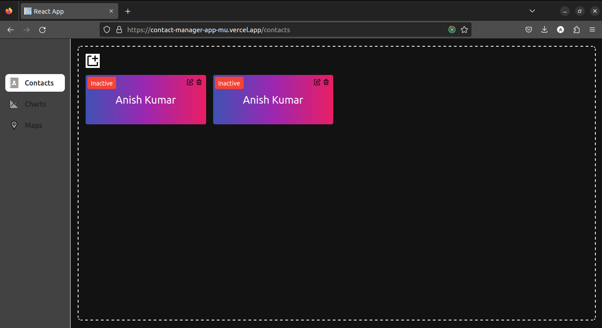

# Contact Managment App :-
A Contact Managment app is a tool that allows users to create, edit, and delete contact details with ease .

<h3 align="center">
   Contact Managment Website Contact page preview-  
  
  Resume Builder Website add detials page-   

</h3>

## Live link for project

## Available Pages

In the project We have below pages.

### `Contact Page`
In Contact Page you can add, edit and delete you contact list.

### `CHART Page`

On chart page you will be able to see the covid data anslis such as how many effected, how many recovered and how many died . 

Graph(Chart) data for cases with date: https://disease.sh/v3/covid-19/historical/all?lastdays=all

### `Maps Page`

On Maps page we can see the covid caes data in terms of country. when ever we will put out courser on any country's flag it will show the number of covid cases in that particuler country.

Country Specific data of cases: https://disease.sh/v3/covid-19/countries

## ⭐ Technologies that are used.

### FrontEnd
- #### React (TypeScript) 
    This app is fully built on top of react library.
- #### Axios 
    Used for making api calls.
- #### Tailwind
    for css . 
- #### React-Toastify
    for showing error massage. 
    

## 🛠 Installation and Setup Instructions

1. Installation: `npm install`

2. In the project directory, you can run: `npm start`

Runs the app in the development mode.\
Open [http://localhost:3000](http://localhost:3000) to view it in the browser.
The page will reload if you make edits.

  
### Endpoint
- Country Specific data of cases: https://disease.sh/v3/covid-19/countries

- Graph data for cases with date: https://disease.sh/v3/covid-19/historical/all?lastdays=all

## 🛠 Installation and Setup Instructions

1. Installation: `npm install`

2. In the project directory, you can run: `npm start`

##
<h4 align="center">Made with ❤️ from Anish</h4>
<h4 align="center">Thank You</h4>

